# Module Dependency Graph

> Auto-generated by `scripts/generate-module-graph.ts` — do not edit manually.  
> Last generated: 2026-04-01  
> Modules: 66 | Edges: 133

## How to Read This

- Arrow direction: **consumer → dependency** (e.g. `AttendanceModule --> AuthModule` means Attendance imports Auth)
- Infrastructure modules excluded: `PrismaModule`, `RedisModule`, `CommonModule`, `SentryModule`, `BullModule`, `ConfigModule`
- Regenerate at any time: `npx tsx scripts/generate-module-graph.ts`

## Dependency Graph

```mermaid
graph TD

  subgraph Core_Infrastructure["Core Infrastructure"]
    ApprovalsModule
    AuthModule
    TenantsModule
  end

  subgraph Student__Academic["Student & Academic"]
    AcademicsModule
    AttendanceModule
    ClassRequirementsModule
    ClassesModule
    GradebookModule
    HomeworkModule
    PeriodGridModule
    ReportCardModule
    RoomsModule
    SchedulesModule
    SchedulingModule
    SchedulingRunsModule
    SchoolClosuresModule
    StaffAvailabilityModule
    StaffPreferencesModule
    StudentsModule
  end

  subgraph Pastoral__Wellbeing["Pastoral & Wellbeing"]
    BehaviourAdminModule
    BehaviourAnalyticsModule
    BehaviourCoreModule
    BehaviourDisciplineModule
    BehaviourModule
    BehaviourRecognitionModule
    BehaviourSafeguardingModule
    ChildProtectionModule
    CriticalIncidentsModule
    HealthModule
    PastoralAdminModule
    PastoralCasesModule
    PastoralCheckinsModule
    PastoralCheckinsSubModule
    PastoralCoreModule
    PastoralCriticalIncidentsModule
    PastoralDsarModule
    PastoralModule
    PastoralSstModule
    SecurityIncidentsModule
    SenModule
    StaffWellbeingModule
  end

  subgraph Finance__HR["Finance & HR"]
    FinanceModule
    HouseholdsModule
    PayrollModule
  end

  subgraph People["People"]
    AdmissionsModule
    ParentsModule
    RegistrationModule
    StaffProfilesModule
  end

  subgraph Communications__Engagement["Communications & Engagement"]
    CommunicationsModule
    EngagementModule
    ParentInquiriesModule
    WebsiteModule
  end

  subgraph Platform__Config["Platform & Config"]
    AuditLogModule
    ComplianceModule
    ConfigurationModule
    DashboardModule
    EarlyWarningModule
    GdprModule
    ImportsModule
    PreferencesModule
    RbacModule
    RegulatoryModule
    ReportsModule
    SearchModule
  end

  subgraph Shared_Services["Shared Services"]
    PdfRenderingModule
    S3Module
  end

  %% Dependencies
  AcademicsModule --> AuthModule
  AdmissionsModule --> ApprovalsModule
  AdmissionsModule --> ConfigurationModule
  AdmissionsModule --> SearchModule
  AdmissionsModule --> TenantsModule
  AttendanceModule --> AuthModule
  AttendanceModule --> CommunicationsModule
  AttendanceModule --> ConfigurationModule
  AttendanceModule --> GdprModule
  AttendanceModule --> SchoolClosuresModule
  BehaviourAdminModule --> AuthModule
  BehaviourAdminModule --> BehaviourCoreModule
  BehaviourAdminModule --> BehaviourDisciplineModule
  BehaviourAdminModule --> PdfRenderingModule
  BehaviourAnalyticsModule --> AuthModule
  BehaviourAnalyticsModule --> BehaviourCoreModule
  BehaviourAnalyticsModule --> GdprModule
  BehaviourCoreModule --> AuthModule
  BehaviourCoreModule --> TenantsModule
  BehaviourDisciplineModule --> AuthModule
  BehaviourDisciplineModule --> BehaviourCoreModule
  BehaviourDisciplineModule --> PdfRenderingModule
  BehaviourDisciplineModule --> S3Module
  BehaviourDisciplineModule --> TenantsModule
  BehaviourModule --> BehaviourAdminModule
  BehaviourModule --> BehaviourAnalyticsModule
  BehaviourModule --> BehaviourCoreModule
  BehaviourModule --> BehaviourDisciplineModule
  BehaviourModule --> BehaviourRecognitionModule
  BehaviourModule --> BehaviourSafeguardingModule
  BehaviourRecognitionModule --> AuthModule
  BehaviourRecognitionModule --> BehaviourCoreModule
  BehaviourSafeguardingModule --> AuthModule
  BehaviourSafeguardingModule --> ChildProtectionModule
  BehaviourSafeguardingModule --> PastoralCoreModule
  BehaviourSafeguardingModule --> PdfRenderingModule
  BehaviourSafeguardingModule --> TenantsModule
  ChildProtectionModule --> AuthModule
  ChildProtectionModule --> PastoralCoreModule
  ChildProtectionModule --> PdfRenderingModule
  ChildProtectionModule --> TenantsModule
  ClassRequirementsModule --> AuthModule
  ClassesModule --> AuthModule
  ClassesModule --> SchedulesModule
  CommunicationsModule --> ApprovalsModule
  CommunicationsModule --> GdprModule
  ComplianceModule --> GdprModule
  ComplianceModule --> PastoralCoreModule
  ComplianceModule --> S3Module
  ComplianceModule --> SearchModule
  ConfigurationModule --> S3Module
  DashboardModule --> AuthModule
  DashboardModule --> ReportsModule
  EngagementModule --> PdfRenderingModule
  FinanceModule --> ApprovalsModule
  FinanceModule --> ConfigurationModule
  FinanceModule --> PdfRenderingModule
  FinanceModule --> TenantsModule
  GdprModule --> AuthModule
  GradebookModule --> AcademicsModule
  GradebookModule --> AuthModule
  GradebookModule --> CommunicationsModule
  GradebookModule --> ConfigurationModule
  GradebookModule --> PdfRenderingModule
  HealthModule --> SearchModule
  HomeworkModule --> S3Module
  HouseholdsModule --> AuthModule
  HouseholdsModule --> RegistrationModule
  HouseholdsModule --> TenantsModule
  ImportsModule --> ConfigurationModule
  ImportsModule --> S3Module
  ImportsModule --> TenantsModule
  ParentsModule --> AuthModule
  PastoralAdminModule --> AuthModule
  PastoralAdminModule --> ChildProtectionModule
  PastoralAdminModule --> PastoralCoreModule
  PastoralAdminModule --> PdfRenderingModule
  PastoralCasesModule --> AuthModule
  PastoralCasesModule --> PastoralCoreModule
  PastoralCasesModule --> TenantsModule
  PastoralCheckinsSubModule --> AuthModule
  PastoralCheckinsSubModule --> PastoralCoreModule
  PastoralCoreModule --> AuthModule
  PastoralCoreModule --> CommunicationsModule
  PastoralCriticalIncidentsModule --> AuthModule
  PastoralCriticalIncidentsModule --> PastoralCoreModule
  PastoralCriticalIncidentsModule --> TenantsModule
  PastoralModule --> PastoralAdminModule
  PastoralModule --> PastoralCasesModule
  PastoralModule --> PastoralCheckinsSubModule
  PastoralModule --> PastoralCoreModule
  PastoralModule --> PastoralCriticalIncidentsModule
  PastoralModule --> PastoralSstModule
  PastoralSstModule --> AuthModule
  PastoralSstModule --> PastoralCoreModule
  PayrollModule --> ApprovalsModule
  PayrollModule --> ConfigurationModule
  PayrollModule --> PdfRenderingModule
  PeriodGridModule --> AuthModule
  RegistrationModule --> AuthModule
  RegistrationModule --> ConfigurationModule
  RegistrationModule --> FinanceModule
  RegistrationModule --> TenantsModule
  RegulatoryModule --> AuthModule
  RegulatoryModule --> S3Module
  ReportCardModule --> GdprModule
  ReportCardModule --> PdfRenderingModule
  ReportsModule --> ConfigurationModule
  ReportsModule --> GdprModule
  RoomsModule --> AuthModule
  SchedulesModule --> AuthModule
  SchedulesModule --> RoomsModule
  SchedulingModule --> AuthModule
  SchedulingModule --> ConfigurationModule
  SchedulingModule --> GdprModule
  SchedulingRunsModule --> AuthModule
  SchedulingRunsModule --> PeriodGridModule
  SchoolClosuresModule --> AuthModule
  SearchModule --> AuthModule
  SecurityIncidentsModule --> AuthModule
  SecurityIncidentsModule --> TenantsModule
  SenModule --> AuthModule
  SenModule --> ConfigurationModule
  SenModule --> TenantsModule
  StaffAvailabilityModule --> AuthModule
  StaffPreferencesModule --> AuthModule
  StaffProfilesModule --> AuthModule
  StaffProfilesModule --> ConfigurationModule
  StaffProfilesModule --> TenantsModule
  StaffWellbeingModule --> ConfigurationModule
  StudentsModule --> AuthModule
  StudentsModule --> TenantsModule
  TenantsModule --> AuthModule
```

